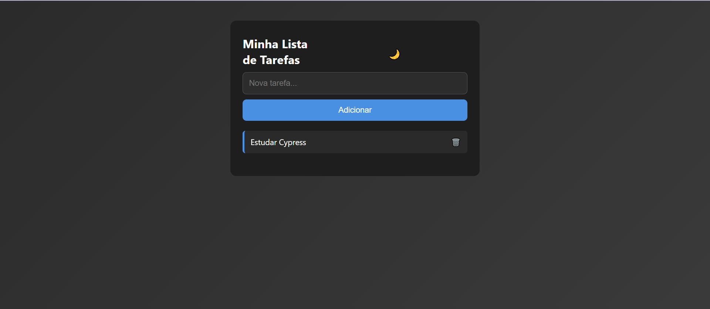
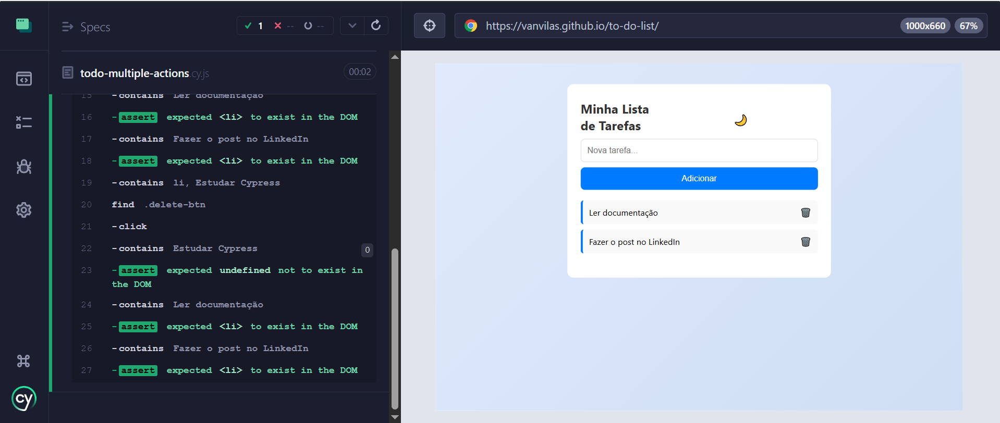

# 📝 To-Do List


Uma aplicação web interativa de **lista de tarefas (To-Do List)**, desenvolvida com **HTML**, **CSS** e **JavaScript**. Conta com funcionalidades completas, testes automatizados com **Jest** e **Cypress**, e está preparada para integração contínua com **GitHub Actions**.

## 📸 Preview do Projeto



## 🔗 Acesse o Projeto Online

[](https://vanvilas.github.io/to-do-list/)

## 🚀 Funcionalidades

- ✅ Adicionar e remover tarefas  
- ✅ Armazenamento local com `localStorage`   
- ✅ Layout responsivo  
- ✅ Testes automatizados (Jest e Cypress)  
- ✅ Preparado para integração contínua (CI/CD) 
- ✅ Alternar entre modo claro e escuro 

## 🧪 Testes Automatizados

### ✅ Testes Unitários (Jest)
- Caminho: `__tests__/todo.test.js`
- Comando para executar:
```bash
npx jest
```

### ✅ Testes End-to-End (Cypress)
- Local: `cypress/e2e/toDoList.cy.js`
- Comando para executar: 
```bash 
npx cypress open
```

## 📌 Detalhes dos Testes Automatizados

### ✅ O que foi testado

- Adição de múltiplas tarefas
- Exclusão de tarefas específicas
- Marcar tarefas como concluídas
- Validação de existência no DOM após interações
- Fluxo completo E2E com simulação real do usuário

### 🔧 Como rodar os testes

Certifique-se de ter as dependências instaladas:
```bash
npm install
```
Depois, para abrir o Cypress:
```bash
npx cypress open
```
Ou para rodar em modo headless (útil para CI/CD):
```bash
npx cypress run
```

## 📷 Resultado dos Testes

Abaixo, um exemplo do teste em execução, onde foram adicionadas 3 tarefas, uma foi marcada como concluída e outra removida com sucesso:



## 🛠 Tecnologias Utilizadas

- HTML5
- CSS3
- JavaScript (ES6)
- Jest 
- Cypress 
- GitHub Actions (CI/CD)
- Git e GitHub

## ▶️ Como executar este projeto

### 1. Clone o repositório:
```bash
git clone https://github.com/vanvilas/to-do-list.git
cd to-do-list
```
### 2. Abra no navegador
- Abra o arquivo ```index.html``` diretamente ou 
- Use a extensão **Live Server** no VS Code

### 3. Instale as dependências
```bash
npm install
```
### 4. Execute os testes
- Jest: 
```bash
npx jest
```
- Cypress:
```bash 
npx cypress open
```

## 🚧 Em Construção

- [ ] Integração contínua com GitHub Actions (CI/CD)
- [ ] Deploy online com GitHub Pages

## 👩‍💻 Desenvolvido por

**Vanessa Vilas Boas**  
🎓 Estudante de Engenharia de Software | 💼 Focada em QA e Testes Automatizados

[🔗 GitHub](https://github.com/vanvilas)
[🔗 LinkedIn](linkedin.com/in/vanessa-vilas-boas/)
